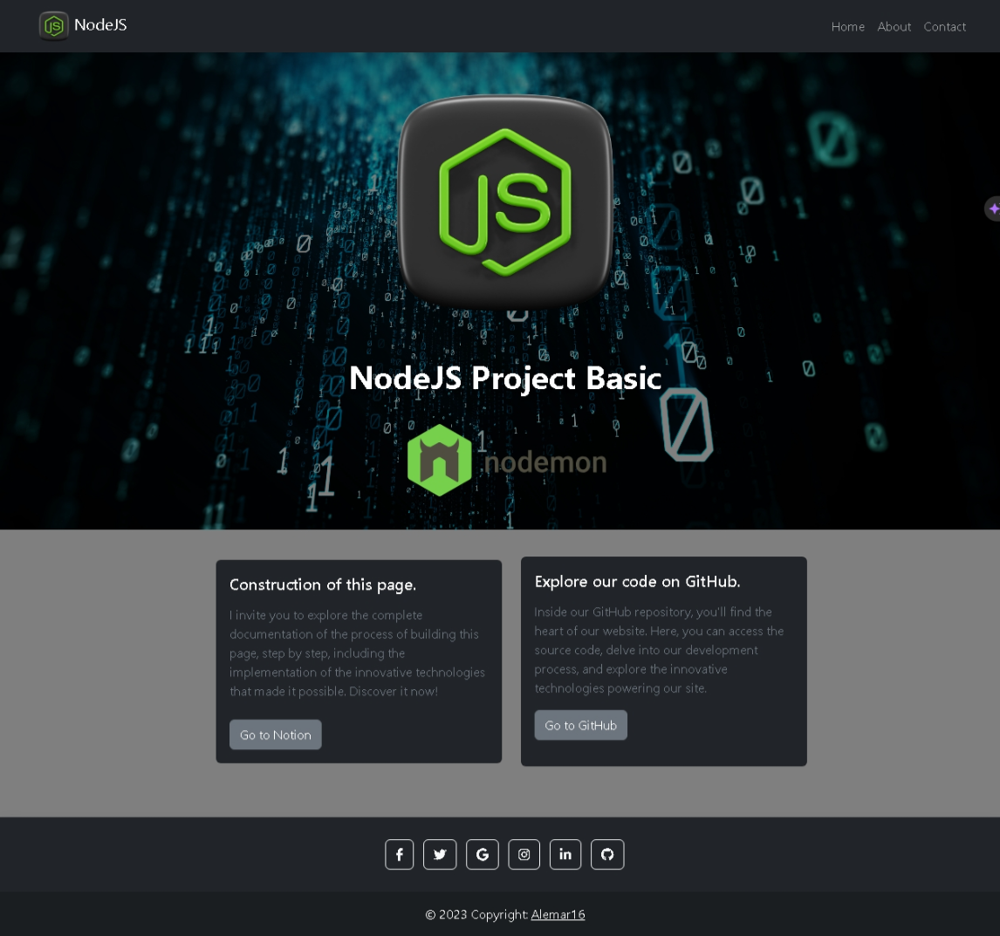
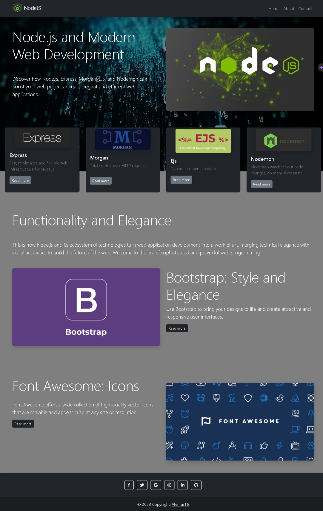

# NodeJS-App

Este proyecto se enfoca en una página web Instructiva y didáctica, construida en el entorno de NodeJS utilizando Express.

A continuación detallaré un poco las tecnologias que que usaron en el proyecto:

- **Express:** Un marco de aplicación web de Node.js que simplifica el desarrollo de aplicaciones web, facilita la creación de rutas y la gestión de solicitudes HTTP.
- **Morgan:** Un middleware de registro HTTP para registrar solicitudes y respuestas HTTP en la consola, tambien ayuda a rastrear y depurar solicitudes y respuestas.
- **Ejs:** Un motor de plantillas para generar vistas dinámicas en Node.js, y permite la generación de contenido HTML.
- **SendGrid:** Una plataforma de envío de correos electrónicos transaccionales y de marketing. En este proyecto su utilidad fue para el envío de correos electrónicos desde la aplicación para opiniones y sugerencias hacia el autor
- **Bootstrap:** Un marco de diseño de código abierto para estilos y diseño web.
- **Toastify:** Una biblioteca de notificaciones emergentes para mejorar la experiencia del usuario.
- **Render:** Como plataforma para hacer el deploy de la pagina y obtener una direccion para compartir

Invitamos a los usuarios a explorar los detalles de este proyecto y encontrar una guía paso a paso en [nuestra página de Notion](https://www.notion.so/NodeJS-Proyecto-B-sico-441d7774822848e9bfe618086ec31843?pvs=4) donde describimos la creación de esta página web de NodeJS-App en detalle.

**Estas son algunas imagenes del la aplicacion:**

  
  
  

